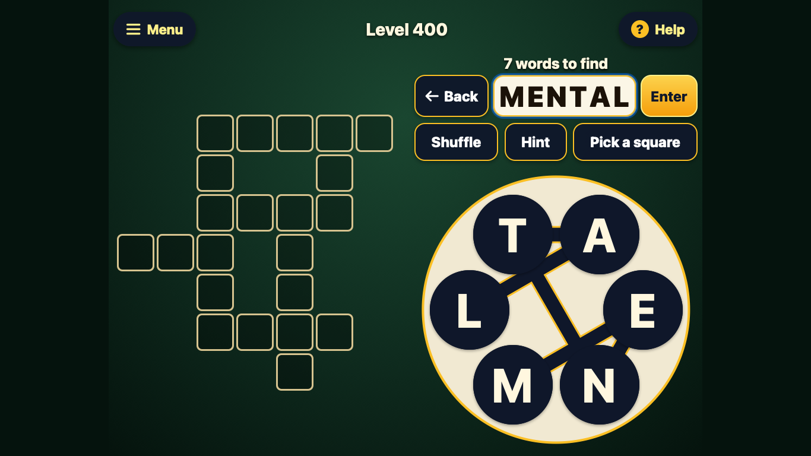
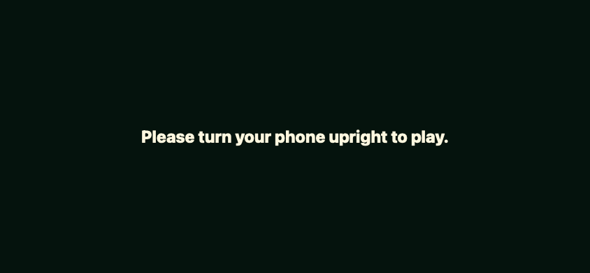
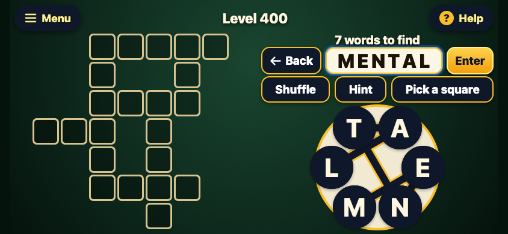

# Words from phone to laptop

Shawn Hanna | Product direction and review coordination | September 30, 2026

I built Word Wheel with Claude as an ad-free word puzzle for my mother. The game has 1,000 English puzzles, free hints and offline play. I then asked Codex to review it, correct errors and publish the improved version as **Words**. I made support for iPhone, iPad and laptop browsers explicit and asked Antigravity to collaborate on visual changes.

[Play Words](https://sghanna.github.io/ai/games/words/) · [Read the source](https://github.com/sghanna/ai/tree/main/games/words) · [Inspect the review](https://github.com/sghanna/ai/blob/main/games/words/REVIEW.md)

*Actual game rendered in desktop WebKit at 1366 x 768, September 30, 2026. MENTAL is composed but not yet submitted. Source: the reviewed Words game; this is a browser capture.*

## My decisions

I wanted the same game to work across the devices we use. I had already selected an iPad layout that expands the phone view in portrait and puts the puzzle and controls side by side in landscape. That choice carried into this release.

My standing requirements for these games also carried forward: readable letters, time to make a move, and controls that accommodate a slow press or a slightly drifting finger. Those requirements came from watching my mother use the earlier games. They gave the review concrete behaviors to check.

For this review, I chose collaboration across the AI tools: Codex examined the game Claude had built, and Antigravity contributed to the responsive design plan. I authorized the corrected release in the shared `ai` repository. The existing puzzles, felt palette and save format were preserved.

## Make each device usable

The original interface could cover a landscape phone or a short laptop window with a request to rotate the phone. At 320 pixels wide, it could also clip “Level 400” to “Level 4.”

The revised game uses compact columns on wider landscape screens. Very small windows can scroll instead of hiding the game. Narrow headers give the level number more room while keeping the Menu and Help labels. On laptops, players can type letters, submit with Enter, and use Tab to reach the wheel and controls and Space to press them.

*Before: the original Word Wheel at 844 x 390, rendered in desktop WebKit on September 30, 2026. Source: the original game copied for review.*

*After: the reviewed game at the same 844 x 390 viewport and puzzle level, captured in desktop WebKit on the same date. The word in the strip demonstrates entry; no physical phone was used for these captures.*

## Review the interactions between features

The review exposed a completion bug: moving to another level while a celebration was running could label the new, unfinished puzzle complete. The fix discards results from animations belonging to a level the player has left.

Claude's independent review of the changes caught two more interactions. Advancing while zoomed could leave the old board visible. Pressing Enter on a hint square could also submit the word being composed. Both were corrected and covered by regression checks. Reintroducing either bug made its check fail.

Codex also corrected cancelled touches, returning drags and keyboard focus escaping behind menus. Antigravity reviewed the layout plan using supplied measurements; Codex inspected the resulting browser renders. Claude approved the final code and independently reran the new regression suite.

## What shipped

Words is published with touch, mouse and keyboard play, saved progress, free hints and offline support. The new installation uses a separate offline cache while retaining the original save keys for browsers that share the same storage.

| Evidence | Verified result |
| --- | --- |
| Puzzle definitions | All 1,000 levels pass dictionary and grid checks. |
| Original browser suite | 2,098 UI checks pass in WebKit. |
| Added regression suite | 212 checks pass across WebKit and Chromium, including offline play and zoom behavior. |
| Responsive review | 17 viewport sizes were checked in both engines; selected actual renders were inspected. |
| Published release | All 12 runtime assets matched the reviewed source. Live checks passed: phone-size play and laptop resizing in WebKit, and offline play in Chromium. |

Claude built the original game. Codex implemented and tested the revisions. Antigravity contributed design recommendations, and Claude independently checked the changes. My contribution was the product direction: choosing the devices and interaction requirements, requesting the review and visual collaboration, and authorizing publication.

## What comes next

The remaining check is ordinary play on real iPhone and iPad devices: slow presses, finger drift, Safari bars, rotation, pinch zoom, VoiceOver and Home Screen installation. Rotating while already zoomed can retain the earlier board dimensions until zooming out. Spanish and Vietnamese interface text also needs native-speaker review.

The automated checks establish software behavior. A playtest will show whether the revised game works well for my mother in daily use.
